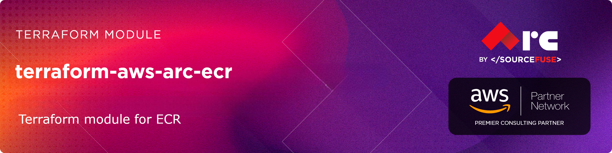

# [terraform-aws-arc-ecr](https://github.com/sourcefuse/terraform-aws-arc-ecr)

<a href="https://github.com/sourcefuse/terraform-aws-arc-ecr/releases/latest"></a> <a href="https://github.com/sourcefuse/terraform-aws-arc-ecr/commits"></a>  

[](https://sonarcloud.io/summary/new_code?id=sourcefuse_terraform-aws-arc-ecr)

## Overview

SourceFuse AWS Reference Architecture (ARC) Terraform module for managing the ECR module.

## Features

- **Complete ECR Management**: Support for all ECR resource types
- **Conditional Resource Creation**: Create only the resources you need
- **Security Best Practices**: Encryption, scanning, and least-privilege policies
- **Multi-Region Replication**: Cross-region and cross-account replication support
- **Lifecycle Management**: Automated image cleanup policies
- **Pull-Through Cache**: Cache public registry images
- **Flexible Tagging**: Consistent tagging across all resources
- **Production Ready**: Follows AWS Well-Architected principles

## Usage

```hcl
module "ecr" {
  source      = "sourcefuse/arc-ecr/aws"
  version     = "0.0.1"

  # Basic Configuration
  repositories = {
    "my-app" = {
      image_tag_mutability = "MUTABLE"
      scan_on_push        = true
      encryption_type     = "KMS"
      kms_key_id         = "alias/ecr-key"
    }
  }

  # Optional Features

  replication_configuration = {
    enabled = true
    rules   = [
      {
        destinations = [
          {
            region      = "us-east-1"
            registry_id = "123456789012"
          }
        ]
        repository_filters = [
          {
            filter      = "my-app"
            filter_type = "PREFIX_MATCH"
          }
        ]
      }
    ]
  }

  # Tagging
  tags = {
    Environment = "production"
    Team        = "platform"
    Project     = "container-registry"
  }
}
```

## Examples

- [Basic ECR Repository](./examples/basic-repository/)
- [Comprehensive Repository](./examples/comprehensive-repository/)
- [ECR with Lifecycle Policy](./examples/lifecycle-policy/)
- [ECR with Repository Policy](./examples/repository-policy/)
- [ECR with Replication](./examples/replication/)
- [ECR with Pull-Through Cache](./examples/pull-through-cache/)
- [ECR with Registry Scanning](./examples/registry-scanning/)
- [ECR with Repository Creation Template](./examples/repository-template/)


<!-- BEGINNING OF PRE-COMMIT-TERRAFORM DOCS HOOK -->
## Requirements

| Name | Version |
|------|---------|
| <a name="requirement_terraform"></a> [terraform](#requirement\_terraform) | >= 1.5.0 |
| <a name="requirement_aws"></a> [aws](#requirement\_aws) | >= 5.0, < 7.0 |

## Providers

| Name | Version |
|------|---------|
| <a name="provider_aws"></a> [aws](#provider\_aws) | 6.15.0 |

## Modules

No modules.

## Resources

| Name | Type |
|------|------|
| [aws_ecr_account_setting.this](https://registry.terraform.io/providers/hashicorp/aws/latest/docs/resources/ecr_account_setting) | resource |
| [aws_ecr_lifecycle_policy.this](https://registry.terraform.io/providers/hashicorp/aws/latest/docs/resources/ecr_lifecycle_policy) | resource |
| [aws_ecr_pull_through_cache_rule.this](https://registry.terraform.io/providers/hashicorp/aws/latest/docs/resources/ecr_pull_through_cache_rule) | resource |
| [aws_ecr_registry_policy.this](https://registry.terraform.io/providers/hashicorp/aws/latest/docs/resources/ecr_registry_policy) | resource |
| [aws_ecr_registry_scanning_configuration.this](https://registry.terraform.io/providers/hashicorp/aws/latest/docs/resources/ecr_registry_scanning_configuration) | resource |
| [aws_ecr_replication_configuration.this](https://registry.terraform.io/providers/hashicorp/aws/latest/docs/resources/ecr_replication_configuration) | resource |
| [aws_ecr_repository.this](https://registry.terraform.io/providers/hashicorp/aws/latest/docs/resources/ecr_repository) | resource |
| [aws_ecr_repository_creation_template.this](https://registry.terraform.io/providers/hashicorp/aws/latest/docs/resources/ecr_repository_creation_template) | resource |
| [aws_ecr_repository_policy.this](https://registry.terraform.io/providers/hashicorp/aws/latest/docs/resources/ecr_repository_policy) | resource |

## Inputs

| Name | Description | Type | Default | Required |
|------|-------------|------|---------|:--------:|
| <a name="input_account_setting"></a> [account\_setting](#input\_account\_setting) | ECR account setting | <pre>object({<br/>    name  = string<br/>    value = string<br/>  })</pre> | <pre>{<br/>  "name": null,<br/>  "value": null<br/>}</pre> | no |
| <a name="input_pull_through_cache_rules"></a> [pull\_through\_cache\_rules](#input\_pull\_through\_cache\_rules) | Pull through cache rules | <pre>map(object({<br/>    ecr_repository_prefix      = string<br/>    upstream_registry_url      = string<br/>    credential_arn             = optional(string)<br/>    custom_role_arn            = optional(string)<br/>    upstream_repository_prefix = optional(string)<br/>  }))</pre> | `{}` | no |
| <a name="input_registry_policy"></a> [registry\_policy](#input\_registry\_policy) | Registry policy JSON | `string` | `null` | no |
| <a name="input_registry_scanning_configuration"></a> [registry\_scanning\_configuration](#input\_registry\_scanning\_configuration) | Registry scanning configuration | <pre>object({<br/>    enabled   = bool<br/>    scan_type = optional(string, "ENHANCED")<br/>    rules = optional(list(object({<br/>      scan_frequency = string<br/>      repository_filters = list(object({<br/>        filter      = string<br/>        filter_type = string<br/>      }))<br/>    })), [])<br/>  })</pre> | <pre>{<br/>  "enabled": false,<br/>  "rules": [],<br/>  "scan_type": "ENHANCED"<br/>}</pre> | no |
| <a name="input_replication_configuration"></a> [replication\_configuration](#input\_replication\_configuration) | Replication configuration for ECR registry | <pre>object({<br/>    enabled = bool # Enable replication configuration<br/>    rules = list(object({<br/>      destinations = list(object({<br/>        region      = string<br/>        registry_id = string<br/>      }))<br/>      repository_filters = optional(list(object({<br/>        filter      = string<br/>        filter_type = string<br/>      })), [])<br/>    }))<br/>  })</pre> | <pre>{<br/>  "enabled": false,<br/>  "rules": []<br/>}</pre> | no |
| <a name="input_repositories"></a> [repositories](#input\_repositories) | Map of ECR repositories to create | <pre>map(object({<br/>    force_delete         = optional(bool, false)<br/>    image_tag_mutability = optional(string, "MUTABLE")<br/>    encryption_type      = optional(string, "AES256")<br/>    kms_key              = optional(string)<br/>    scan_on_push         = optional(bool, true)<br/>    lifecycle_policy     = optional(string)<br/>    repository_policy    = optional(string)<br/>    repository_tags      = optional(map(string), {})<br/>    image_tag_mutability_exclusion_filters = optional(list(object({<br/>      filter      = string<br/>      filter_type = string<br/>    })), [])<br/>  }))</pre> | `{}` | no |
| <a name="input_repository_creation_template"></a> [repository\_creation\_template](#input\_repository\_creation\_template) | Repository creation template configuration | <pre>object({<br/>    prefix               = string<br/>    applied_for          = list(string)<br/>    custom_role_arn      = optional(string)<br/>    description          = optional(string)<br/>    encryption_type      = optional(string, "AES256")<br/>    kms_key              = optional(string)<br/>    image_tag_mutability = optional(string, "MUTABLE")<br/>    lifecycle_policy     = optional(string)<br/>    repository_policy    = optional(string)<br/>    resource_tags        = optional(map(string), {})<br/>    image_tag_mutability_exclusion_filters = optional(list(object({<br/>      filter      = string<br/>      filter_type = string<br/>    })), [])<br/>  })</pre> | `null` | no |
| <a name="input_tags"></a> [tags](#input\_tags) | Tags to apply to all resources | `map(string)` | `{}` | no |

## Outputs

| Name | Description |
|------|-------------|
| <a name="output_pull_through_cache_rule_registry_ids"></a> [pull\_through\_cache\_rule\_registry\_ids](#output\_pull\_through\_cache\_rule\_registry\_ids) | Registry IDs from pull through cache rules |
| <a name="output_registry_id"></a> [registry\_id](#output\_registry\_id) | Registry ID |
| <a name="output_replication_configuration_registry_id"></a> [replication\_configuration\_registry\_id](#output\_replication\_configuration\_registry\_id) | Registry ID from replication configuration |
| <a name="output_repository_arns"></a> [repository\_arns](#output\_repository\_arns) | ARNs of the ECR repositories |
| <a name="output_repository_creation_template_registry_id"></a> [repository\_creation\_template\_registry\_id](#output\_repository\_creation\_template\_registry\_id) | Registry ID from repository creation template |
| <a name="output_repository_names"></a> [repository\_names](#output\_repository\_names) | Names of the ECR repositories |
| <a name="output_repository_registry_ids"></a> [repository\_registry\_ids](#output\_repository\_registry\_ids) | Registry IDs of the ECR repositories |
| <a name="output_repository_urls"></a> [repository\_urls](#output\_repository\_urls) | URLs of the ECR repositories |
<!-- END OF PRE-COMMIT-TERRAFORM DOCS HOOK -->

## Development

### Prerequisites

- [terraform](https://learn.hashicorp.com/terraform/getting-started/install#installing-terraform)
- [terraform-docs](https://github.com/segmentio/terraform-docs)
- [pre-commit](https://pre-commit.com/#install)
- [golang](https://golang.org/doc/install#install)
- [golint](https://github.com/golang/lint#installation)

### Configurations

- Configure pre-commit hooks
  ```sh
  pre-commit install
  ```

### Versioning

while Contributing or doing git commit please specify the breaking change in your commit message whether its major,minor or patch

For Example

```sh
git commit -m "your commit message #major"
```
By specifying this , it will bump the version and if you don't specify this in your commit message then by default it will consider patch and will bump that accordingly

## Authors

This project is authored by:
- SourceFuse ARC Team
